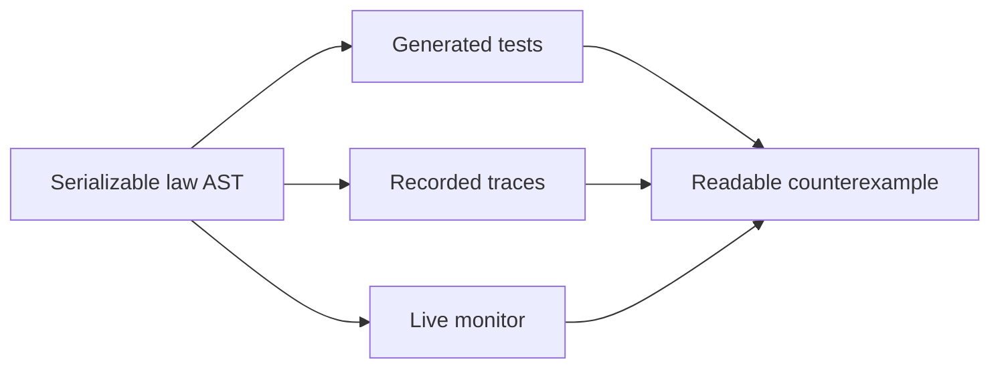

<picture>
  <source media="(prefers-color-scheme: dark)" srcset="./assets/eventlaw-wordmark-dark.png">
  <source media="(prefers-color-scheme: light)" srcset="./assets/eventlaw-wordmark-light.png">
  
</picture>

<p align="center">
  <a href="https://github.com/luantaraschi/eventlaw/actions/workflows/ci.yml"></a>
  <a href="./package.json"></a>
  <a href="./package.json"></a>
  <a href="./LICENSE"></a>
  <a href="#project-status"></a>
</p>

<p align="center">
  <a href="#the-problem">Why</a> ·
  <a href="#a-law-you-can-read">Define</a> ·
  <a href="#verify-a-recorded-trace">Verify</a> ·
  <a href="#monitor-live-events">Monitor</a> ·
  <a href="#contributing">Contribute</a>
</p>

Write a behavior law once. Falsify it with generated inputs, verify recorded
traces, and monitor live events with the same serializable definition.

> `eventlaw` is a research preview. The repository is ready for design partners
> and experiments, but the package is not published yet.

## The problem

The same production rule usually exists three times:

- as an assertion in a test;
- as a query over recorded events;
- as an alert in production.

Those copies drift. They disagree about deadlines, correlation keys, partition
boundaries, and what an incomplete trace means. When one fails, the result is
often a boolean or a large log dump instead of the smallest sequence that
explains the violation.

`eventlaw` turns the rule into portable data:



No LTL notation, wall clock, event bus, agent framework, or runtime dependency is
required by the core.

## A law you can read

```ts
import { after, atMostOnce, defineLaws, event, never, ref } from 'eventlaw'

const laws = defineLaws({
  paymentCompletes: after(event('payment.requested').capture('paymentId', 'id'))
    .eventually(event('payment.captured').equals('id', ref('paymentId')))
    .within(5_000)
    .partitionBy('accountId'),

  noCaptureWhileFrozen: never(event('payment.captured'))
    .between(event('account.frozen'), event('account.unfrozen'))
    .partitionBy('accountId'),

  oneCapturePerRetryWindow: atMostOnce(event('payment.captured'))
    .per('id')
    .within(24 * 60 * 60 * 1_000),
})
```

The definition is plain JSON-safe data. It can cross a worker boundary, be saved
beside a trace, or run in a different process without serializing JavaScript
functions.

## Verify a recorded trace

```ts
import { formatReport, verifyTrace, type TraceEvent } from 'eventlaw'

const trace: TraceEvent[] = [
  { type: 'payment.requested', accountId: 'a-17', id: 'p-42', at: 1_000 },
  { type: 'process.crashed', accountId: 'a-17', at: 2_000 },
]

const report = verifyTrace(trace, laws, { complete: true, now: 6_000 })
console.log(formatReport(report, trace))
```

```text
paymentCompletes failed

  no payment.captured arrived within 5000ms of payment.requested
  partition: "a-17"

  +    0ms  payment.requested {"accountId":"a-17","id":"p-42"}
  + 5000ms  deadline
```

Reports use `pass`, `fail`, or `pending`. A law that never saw its trigger passes
vacuously and says so, which catches misspelled event names and empty fixtures
that would otherwise look green.

## Find and shrink failures

The optional `eventlaw/fast-check` adapter shrinks both the generated input and
the behavioral trace it emitted:

```ts
import fc from 'fast-check'
import { falsify } from 'eventlaw/fast-check'

const failure = await falsify({
  arbitrary: fc.array(commandArbitrary),
  run: (commands) => runSystem(commands),
  laws,
  law: 'noCaptureWhileFrozen',
  seed: 42,
})
```

The first real integration runs against the published
[`@luantaraschi/lull`](https://github.com/luantaraschi/lull) reducer. A planted
timer bug shrinks to two commands and a two-event counterexample:

```text
Minimal generated case: ["takeover","tick"]
Minimal counterexample: 2 events
```

`fast-check` is an optional peer dependency and is isolated from the main entry.

## Monitor live events

```ts
import { createMonitor, monitoringProfile } from 'eventlaw'

const monitor = createMonitor(laws)

monitor.push({
  type: 'payment.requested',
  accountId: 'a-17',
  id: 'p-42',
  at: 1_000,
})

monitor.advanceTo(6_000) // deadlines also fail during silence

console.log(monitoringProfile(laws))
console.log(monitor.stats())
```

The monitor is incremental: it does not keep or re-verify the complete trace.
An observed violation is terminal because a late event cannot rewrite the fact
that a deadline elapsed.

### Memory is part of the law

`eventlaw` does not hide retention behind a cache option:

| Law                                   | Memory class     | What is retained                                 |
| ------------------------------------- | ---------------- | ------------------------------------------------ |
| `eventually(...).within(d)`           | `window-bounded` | unmatched triggers until consequence or deadline |
| `never(...).between(A, B)`            | `scope-bounded`  | one start for each open partition                |
| `atMostOnce(...).per(key)`            | `unbounded`      | every distinct key for the monitor lifetime      |
| `atMostOnce(...).per(key).within(d)`  | `window-bounded` | latest keys inside the inclusive window          |
| `atMostOnce(...).per(key).resetOn(R)` | `scope-bounded`  | keys since the last reset in each partition      |

`monitoringProfile(laws)` reports the static class and rationale.
`monitor.stats()` reports the logical entries currently retained. Lifetime
uniqueness remains unlimited unless the law explicitly chooses a window or a
scope reset.

## Try it locally

Node.js 22 or newer is required.

```bash
git clone https://github.com/luantaraschi/eventlaw.git
cd eventlaw
npm ci
npm run check
```

Three examples exercise different parts of the project:

```bash
npm run example:lull      # real reducer + minimal temporal failure
npm run example:falsify   # generated commands + two-stage shrinking
npm run example:webhooks  # bounded delivery deduplication
npm run example:jsonl     # verify a recorded JSONL trace
npm run bench:progress    # progress-monitor scaling
```

Recorded traces can be read incrementally from the dependency-free
`eventlaw/jsonl` subpath:

```ts
import { createReadStream } from 'node:fs'
import { readJsonl } from 'eventlaw/jsonl'

const trace = await readJsonl(createReadStream('events.jsonl'), {
  source: 'events.jsonl',
})
const report = verifyTrace(trace, laws, { complete: true })
```

Malformed records report their source and one-based line number. The adapter
expects each line to already contain an event with a non-empty `type` and finite
millisecond `at`; source-specific normalization stays outside the semantic core.

OTLP/JSON event batches have a dedicated dependency-free adapter:

```ts
import { eventsFromOtlpJson } from 'eventlaw/opentelemetry'

const { trace, skippedLogRecords } = eventsFromOtlpJson(otlpPayload)
const report = verifyTrace(trace, laws, { complete: true })
```

Only log records with a non-empty OpenTelemetry `eventName` become events.
`timeUnixNano` is preferred over `observedTimeUnixNano` and truncated to explicit
milliseconds; exact timestamp strings remain under `otel`. The body stays under
`body`, while attributes, resource, and instrumentation scope stay namespaced
under `otel` so none can overwrite `type` or `at`.

The mapping is tested both against the protocol's official fixture and an
OTLP/HTTP request captured from `@opentelemetry/sdk-logs` and
`@opentelemetry/exporter-logs-otlp-http`. Empty AnyValue bodies emitted by the
JavaScript SDK are treated as absent, while ordinary logs remain visible through
`skippedLogRecords`.

The same SDK batch was also sent through the official OpenTelemetry Collector
with JSON re-export. Default-field omission and canonical int64 strings produce
the exact same converted trace as the direct SDK request.

A second Collector capture batches Events from `checkout-api` and
`fulfillment-worker` into one request. Their resource metadata stays distinct,
while `traceId`, `spanId`, and trace `flags` remain available under `otel`. A law
can therefore correlate an order across services without flattening resource
identity:

```ts
after(
  event('order.accepted')
    .capture('orderId', 'otel.attributes.order.id')
    .capture('traceId', 'otel.traceId'),
)
  .eventually(
    event('order.shipped')
      .equals('otel.attributes.order.id', ref('orderId'))
      .equals('otel.traceId', ref('traceId')),
  )
  .within(6_000)
```

## What it is — and is not

`eventlaw` is a small runtime-verification core for event traces. It owns law
definitions, deterministic semantics, counterexample minimization, and
incremental operator state.

It is not an event bus, workflow engine, telemetry backend, test runner, or
general-purpose temporal-logic solver. It does not connect to Kafka or an
OpenTelemetry Collector. Adapters translate source payloads into `TraceEvent`
objects without coupling the semantic core to their SDKs.

## Project status

The current vertical slice includes:

- JSON-safe matchers with field equality, array membership, captures, and refs;
- progress, exclusion, and uniqueness operators;
- partitions, explicit time, three-valued reports, and vacuity warnings;
- deletion-minimal failing traces and readable timelines;
- an incremental monitor with observable retention;
- differential tests proving online/offline prefix equivalence;
- optional property-based generation and shrinking;
- incremental JSONL trace ingestion with line-aware diagnostics;
- structural OTLP/JSON event conversion tested against the official fixture.

The full suite has 69 tests across 10 files, including 1,250 generated
differential traces. TypeScript types, ESM, CommonJS, declarations, formatting,
and the package tarball are checked locally and in CI.

Before a public package release, the API still needs feedback from TypeScript
developers who operate event-driven systems. The first performance decision is
documented in [benchmarks](docs/benchmarks.md), including the quadratic baseline
that justified the deadline index.

## Design constraints

- Law ASTs contain data, not predicate functions.
- Time comes from events or `advanceTo`; the core never reads the wall clock.
- The main entry has no runtime dependencies.
- Online memory claims are operator-specific and observable.
- Retention changes business meaning, so eviction is never implicit.
- Finite and online verification must agree until the first terminal failure.

The normative rules live in [the semantic spec](docs/spec.md). Accepted trade-offs
and their rationale are recorded in [DECISIONS.md](DECISIONS.md).
The [adapter strategy](docs/adapters.md) records the JSONL and OpenTelemetry
mapping contracts and what must be learned before Kafka or durable-state
integration.

## Contributing

Concrete traces are the best feature requests. If a production rule is hard to
express, open an issue with the smallest event sequence that should pass or fail
and write the rule once in plain language.

The [external validation protocol](docs/validation.md) defines the comprehension
and webhook-operator sessions required before publication.

[CONTRIBUTING.md](CONTRIBUTING.md) covers setup, tests, semantic changes, and pull
request expectations. Participation is governed by the
[Code of Conduct](CODE_OF_CONDUCT.md). Security reports should follow
[SECURITY.md](SECURITY.md).

## License

MIT © Luan Taraschi
